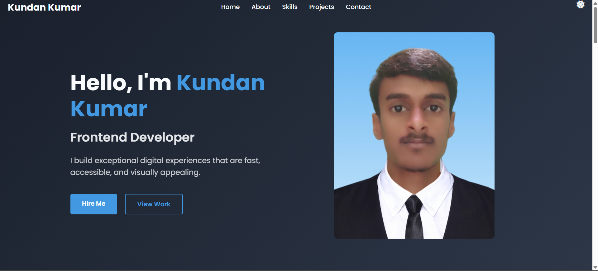

# Kundan Kumar - Portfolio Website



A modern, responsive portfolio website showcasing my skills, projects, and experience as a Frontend Developer. Built with HTML, CSS, and JavaScript.

## 🔗 Live Demo
[View Live Portfolio](https://kundancrafted.netlify.app/)

## ✨ Features

- **Responsive Design**: Works perfectly on all devices
- **Dark/Light Mode**: Toggle between color themes
- **Interactive Elements**: Smooth animations and transitions
- **Project Showcase**: Highlighting my best work
- **Contact Form**: Easy way to get in touch
- **Social Media Integration**: Links to all my profiles 

## 🛠 Technologies Used

- **Frontend**: 
  
  
  
  
- **Tools & Libraries**:
  
  

## 🚀 Installation

To run this project locally:

1. Clone the repository:
```bash
git clone https://github.com/kundan-2026/portfolio.git
